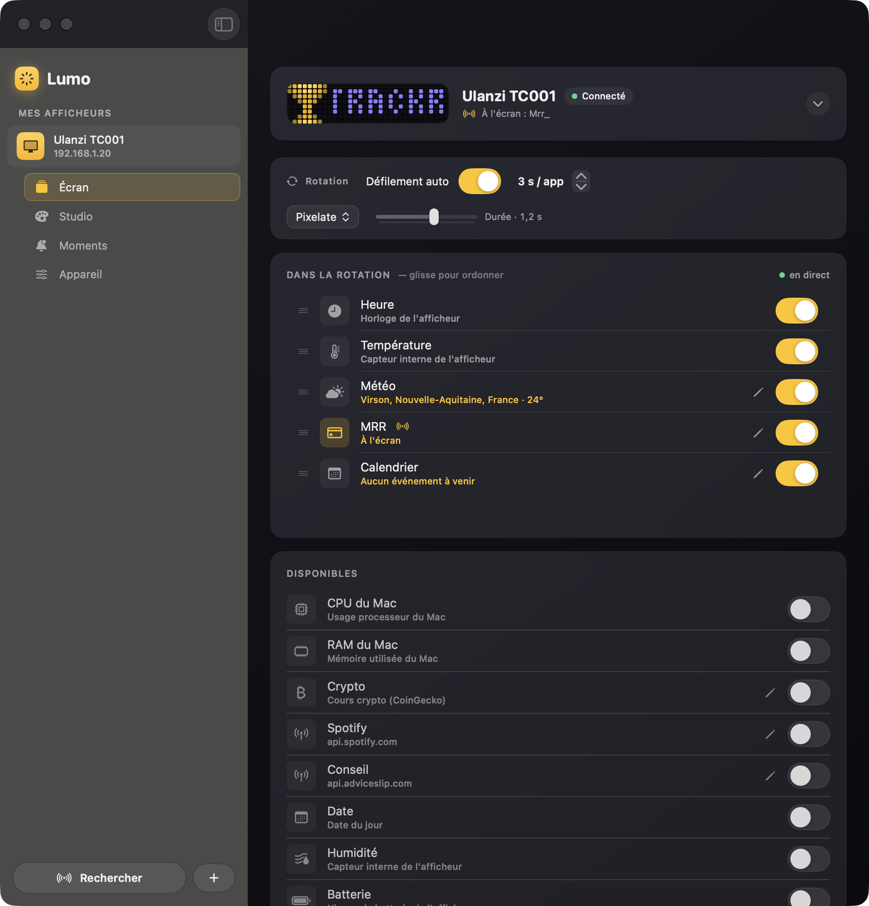

# Lumo

Une application macOS native, élégante, pour piloter vos afficheurs **AWTRIX** (Ulanzi TC001 & co) — pensée pour être simple, belle et sans terminal.

L'interface officielle est austère et demande des manipulations techniques ; Lumo offre une expérience moderne (design Liquid Glass), un aperçu live de la matrice, et surtout un système de **connecteurs** pour afficher *n'importe quelle* donnée sur votre écran.

> ⚠️ Projet communautaire, non affilié à Ulanzi ni au projet AWTRIX.



## ⬇️ Télécharger

Récupérez le `.dmg` dans la page [Releases](../../releases) : l'app est signée Developer ID et notarisée par Apple, elle s'ouvre donc d'un simple double-clic. Ou compilez depuis les sources (voir plus bas).

Les évolutions de chaque version sont dans le [CHANGELOG](CHANGELOG.md).

## ✨ Fonctionnalités

L'app s'organise en quatre sections : **Écran · Studio · Moments · Appareil**.

- **Découverte automatique** des afficheurs sur le réseau (scan, sans mDNS) + ajout manuel par IP, multi-device.
- **Écran — la rotation éditée comme une playlist** : tout ce qui défile est dans une liste ordonnée (glisser pour réordonner, app courante marquée « À l'écran »), les sources éteintes attendent en dessous, un toggle les fait passer d'une zone à l'autre. Aperçu live compact de la matrice 32×8, déployable.
- **Sources prêtes à l'emploi** : météo (Open-Meteo, sans clé), calendrier Apple, CPU/RAM du Mac, cours crypto, apps natives du firmware (heure, date, capteurs).
- **Connecteurs** : branchez n'importe quelle API (la vôtre ou externe), extraction par chemin JSON, gabarit d'affichage, auth (Clé API / Bearer / **OAuth 2.0 + PKCE**), catalogue de modèles prêts à l'emploi (GitHub CI, Plausible, AQI, Tempo EDF, YouTube, Spotify, Stripe, quota Claude Code…).
- **Studio** : compositions texte (couleur, icône) et **pixel art 32×8**, scènes sauvegardées renvoyables en 1 clic (persistantes après reboot).
- **Galerie d'icônes intégrée** : recherche LaMetric, import en 1 clic, conversion/upload automatique (animations préservées).
- **Moments** : notification ponctuelle, **règles d'alerte** (seuils CPU/RAM/batterie/température/connecteur, ou à heure fixe), **minuteur/Pomodoro** affiché sur la matrice, LED témoins, **passerelle de notifications** (curl, Raccourcis, `lumo://notify`).
- **Appareil** : luminosité (manuelle/auto), **mode nuit programmé**, lampe d'ambiance, fiche capteurs.
- **Mode menu-bar** : météo, quotas, minuteur et power sans ouvrir la fenêtre ; données rafraîchies en arrière-plan.
- **Raccourcis / App Intents** en français, interface **FR/EN**.

## 🛠️ Prérequis

- **macOS 26 (Tahoe)** ou plus récent (utilise les APIs Liquid Glass natives).
- **Xcode 26+**.
- [**XcodeGen**](https://github.com/yonatanmd/XcodeGen) : `brew install xcodegen`.
- Un afficheur sous **AWTRIX Light / AWTRIX3** sur le même réseau.

### Mettre l'afficheur sous AWTRIX

Le Ulanzi TC001 est livré avec le **firmware Ulanzi d'origine**, *pas* AWTRIX — Lumo ne fonctionnera pas tant qu'il n'est pas flashé. Branche-le en USB-C et utilise le **flasher web officiel AWTRIX3** (Chrome/Edge) : <https://blueforcer.github.io/awtrix3/#/flasher>. L'opération est réversible. Une fois sur le Wi-Fi, Lumo le découvre automatiquement.

## 🚀 Build

```bash
git clone <repo>
cd Lumo
xcodegen generate          # génère Lumo.xcodeproj depuis project.yml
open Lumo.xcodeproj        # puis Cmd+R dans Xcode
# ou en ligne de commande :
xcodebuild -project Lumo.xcodeproj -scheme Lumo -configuration Debug build
```

### Tests

Tests unitaires (Swift Testing) sur la logique pure — extraction JSON des connecteurs, couleurs, en-têtes/auth, mapping météo, parsing réseau :

```bash
xcodebuild -project Lumo.xcodeproj -scheme Lumo -destination 'platform=macOS' test
```

## 🧱 Architecture

SwiftUI, organisé par responsabilité :

```
Lumo/
  App/          point d'entrée, scènes (fenêtre + menu-bar)
  Models/       Device, AwtrixStats/Settings, PushPayload, Scene, Connector…
  Networking/   AwtrixClient (API REST AWTRIX), DeviceDiscovery, NetworkUtils
  Services/     DeviceStore, WeatherStation, LiveAppsStation, ConnectorsStation,
                AlertsStation, PomodoroStation, NightModeStation, CalendarStation,
                NotificationGateway, OAuthService, IconConverter, ScreenStreamer…
  Views/        Sidebar, DeviceDetail, NowPlayingBar, DeviceScreen (rotation),
                Studio (Compose + Draw + scènes), Moments, DeviceSettings, sheets…
  Design/       Theme (Liquid Glass, couleurs), SheetScaffold, VisualEffectView
```

Le projet Xcode est **généré** par XcodeGen : on versionne `project.yml`, pas le `.xcodeproj`.

## 🔌 Connecteurs

Un connecteur = URL + (auth) + un **chemin JSON** (`data.price`, `items[0].value`) + un **gabarit** (`{value}€`). Exemple Bitcoin :

- URL : `https://api.coingecko.com/api/v3/simple/price?ids=bitcoin&vs_currencies=eur`
- Chemin : `bitcoin.eur` · Gabarit : `BTC {value}€`

### OAuth

Lumo gère OAuth 2.0 (Authorization Code + PKCE), redirection `lumo://oauth`. Pour les services préconfigurés (ex. Spotify), il faut un **Client ID** (non secret avec PKCE). Sans configuration, l'app affiche un guide pour le saisir à la main.

Pour embarquer un Client ID par défaut (build « officiel »), renseigne-le dans `Config/Secrets.xcconfig` :

```
SPOTIFY_CLIENT_ID = ton_client_id
```

Il est injecté dans l'app via `Info.plist` — aucun secret n'est commité dans le dépôt.

## 🤝 Contribuer

Issues et PR bienvenues : support d'autres afficheurs (LaMetric, Pixoo/Divoom, WLED), nouveaux modèles de connecteurs, traductions… Voir [CONTRIBUTING.md](CONTRIBUTING.md).

## 📄 Licence

MIT — voir [LICENSE](LICENSE).
